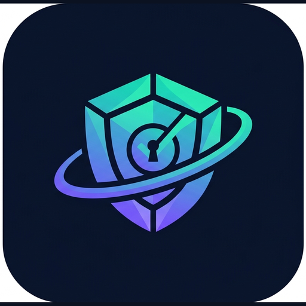

# CyberShield360 By Mujtaba

<br clear="left"/>

> Signature palette: teal `#10B5A6` → violet `#7C5CFC`. See `docs/BRAND.md`.

A **multi-tenant cybersecurity SaaS platform** built with **ASP.NET Core 9**, **SQL Server**, **EF Core**, and **Clean Architecture** (CQRS + MediatR + Repository pattern). It provides security posture assessment, website scanning, brand/domain monitoring, vulnerability & risk management, employee security-awareness training, authorized phishing simulations, A–F scorecards, white-label reporting, and Stripe-based subscriptions.

---

## ✨ Features

| Area | Capability |
|------|------------|
| Posture | Security posture dashboard, A–F scorecard, score trends |
| Scanning | SSL/TLS, HTTP security headers, DNS health, SPF/DKIM/DMARC |
| Monitoring | Brand monitoring, domain monitoring, social media security audit |
| Training | Awareness training portal, courses, enrollments, quizzes |
| Phishing | Authorized internal phishing simulations (with mandatory authorization gate) |
| Risk | Risk register (likelihood × impact), risk dashboard |
| Vulnerabilities | Tracking, severity/CVSS, remediation workflow & steps |
| Reporting | PDF (QuestPDF) + Excel (ClosedXML), white-label branding |
| Platform | Multi-tenancy, RBAC, JWT auth, audit trails, scheduled scans, email notifications |
| Billing | Subscription plans + Stripe integration |
| AI | AI-powered security recommendations (pluggable LLM / deterministic fallback) |
| Developer | REST API + Swagger/OpenAPI docs, API keys, Docker |

---

## 🏛️ Architecture (Clean Architecture)

```
┌─────────────────────────────────────────────┐
│                  API (Web)                    │  Controllers, Middleware, Swagger, Serilog
├─────────────────────────────────────────────┤
│              Infrastructure                   │  EF Core, Identity, JWT, Scanner, Stripe, Email, Reports
├─────────────────────────────────────────────┤
│               Application                     │  CQRS (MediatR), DTOs, Validators, Behaviours, Interfaces
├─────────────────────────────────────────────┤
│                 Domain                        │  Entities, Enums, Value Objects (no dependencies)
└─────────────────────────────────────────────┘
```

Dependencies point **inward only**. Domain has zero external references. The API depends on
Application + Infrastructure; Infrastructure implements the interfaces declared in Application.

### Folder structure

```
CyberShield360/
├── CyberShield360.sln
├── Directory.Build.props          # shared net9.0 / nullable settings
├── docker-compose.yml             # SQL Server + API
├── src/
│   ├── CyberShield360.Domain/         # Entities, Enums, Common base types
│   ├── CyberShield360.Application/    # CQRS features, interfaces, behaviours
│   │   ├── Common/{Interfaces,Behaviours,Models,Exceptions}
│   │   ├── Features/{Auth,Scans,Vulnerabilities,Dashboard}
│   │   └── Security/Models
│   ├── CyberShield360.Infrastructure/ # EF Core, Identity, services
│   │   ├── Persistence/{ApplicationDbContext,Repository,Configurations,DbSeeder}
│   │   ├── Identity/{JwtTokenService,CurrentUser,TenantProvider}
│   │   └── Services/{SecurityScanner,ReportGenerator,Stripe,Email,Ai,ScoreCalculator}
│   └── CyberShield360.API/            # Controllers, Middleware, Program.cs, appsettings
├── tests/
│   ├── CyberShield360.UnitTests/
│   └── CyberShield360.IntegrationTests/
├── frontend/                       # Responsive dashboard demo (HTML/Tailwind)
└── docs/
    ├── DATABASE_SCHEMA.md
    └── ROADMAP.md
```

---

## 🚀 Getting Started

### Option A — Docker (recommended)
```bash
docker compose up --build
# API:     http://localhost:8080
# Swagger: http://localhost:8080/swagger
```

### Option B — Local
```bash
# 1. Start SQL Server (or use docker compose up sqlserver)
# 2. Apply migrations
dotnet tool install --global dotnet-ef
dotnet ef migrations add InitialCreate \
  -p src/CyberShield360.Infrastructure -s src/CyberShield360.API
dotnet ef database update -p src/CyberShield360.Infrastructure -s src/CyberShield360.API
# 3. Run
dotnet run --project src/CyberShield360.API
```

### Seed credentials (dev)
```
Email:    admin@acme.com
Password: Set your own password from environment variables or local seed settings.
```

> ⚠️ Change `Jwt:Secret`, SA password, and seed credentials before any non-local use.

---

## 🔌 Key API Endpoints

| Method | Route | Auth | Description |
|--------|-------|------|-------------|
| POST | `/api/v1/auth/register` | anon | Register tenant + admin |
| POST | `/api/v1/auth/login` | anon | Obtain JWT |
| GET  | `/api/v1/dashboard/posture` | user | Posture dashboard |
| GET  | `/api/v1/assets` | user | List monitored assets |
| POST | `/api/v1/assets` | admin/analyst | Add asset |
| POST | `/api/v1/scans/run` | admin/analyst | Run a scan |
| GET  | `/api/v1/scans/{id}` | user | Scan + findings |
| GET  | `/api/v1/vulnerabilities` | user | Paged vuln list |
| POST | `/api/v1/vulnerabilities` | admin/analyst | Create vuln |
| PUT  | `/api/v1/vulnerabilities/{id}/status` | admin/analyst | Remediation status |
| GET  | `/api/v1/reports/scan/{id}?format=pdf\|xlsx` | user | Export report |
| POST | `/api/v1/subscriptions/checkout` | admin | Stripe checkout |
| POST | `/api/v1/subscriptions/webhook` | anon | Stripe webhook |
| POST | `/api/v1/phishing/campaigns` | admin | Create authorized simulation |
| GET  | `/api/v1/risks` · `/risks/heatmap` | user | Risk register + heatmap |
| POST | `/api/v1/risks` · PUT `/risks/{id}` | analyst | Create / update risk |
| GET  | `/api/v1/brand/alerts` | user | Brand/domain alerts |
| GET  | `/api/v1/training/enrollments` · `/training/compliance` | user | Training portal |
| GET/POST | `/api/v1/scheduledscans` | analyst | Recurring scan schedules (Hangfire) |
| GET  | `/jobs` | admin | Hangfire background-jobs dashboard |
| GET  | `/health` | anon | Health probe |

Full interactive docs at **`/swagger`**.

---

## 🔐 Multi-tenancy & Security

- **Tenant isolation** enforced by EF Core **global query filters** keyed on `TenantId` resolved
  from the JWT `tenant_id` claim (see `ApplicationDbContext.OnModelCreating`).
- **RBAC** roles: `SuperAdmin`, `TenantAdmin`, `SecurityAnalyst`, `Auditor`, `Member`.
- **JWT bearer** auth with configurable lifetime.
- **Soft deletes** + audit trail on all mutating requests.
- **Phishing simulations** require an explicit `AuthorizationConfirmed` flag and restrict targets
  to the tenant's own employees — for authorized internal training only.

---

## 🧪 Testing
```bash
dotnet test
```
- Unit tests: scoring engine, risk math.
- Integration tests: health endpoint, auth enforcement (via `WebApplicationFactory`).

---

## 📦 Tech Stack
ASP.NET Core 9 · EF Core 9 · SQL Server 2022 · MediatR · FluentValidation · AutoMapper ·
ASP.NET Identity · JWT · Serilog · **Hangfire** · QuestPDF · ClosedXML · Stripe.net · DnsClient · Docker · xUnit.

**Frontend:** React 18 · TypeScript · Vite · Tailwind · Recharts (in `/clientapp`).
